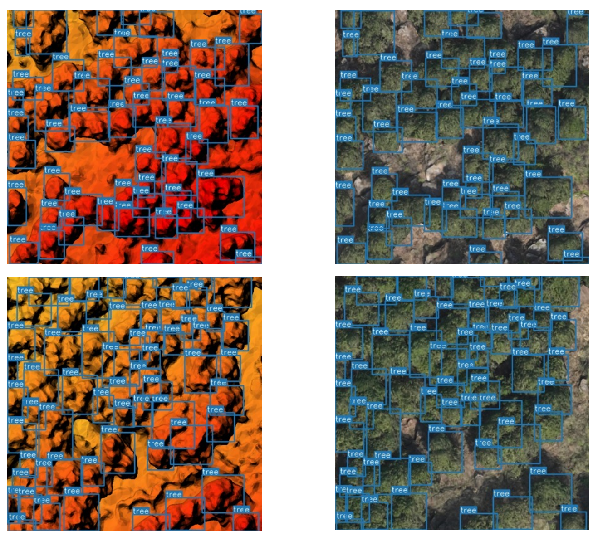

# Multi-Source-remote-sensing-detection-model

[](https://github.com/DocF/multispectral-object-detection/)

[](https://github.com/WdBlink/Multi-Source-remote-sensing-detection-model)


## Intro

This project is based on Multispectral Object Detection with Transformer.

## Abstract
Multi-source data can provide models with more visual information for object recognition tasks, thereby improving the accuracy and speed of object recognition, which has broad application prospects in the remote sensing field. This project can take two custom 3-channel image data as input and output predicted bounding boxes for object detection. It can also read pre-trained models to perform inference directly on large remote sensing grid data, output shapfile, making it convenient to visualize the results in GIS software.

 
## Installation 
Python>=3.6.0 is required with all requirements.txt installed including PyTorch>=1.7 (The same as yolov5 https://github.com/ultralytics/yolov5 ).

#### Clone the repo
    git clone https://github.com/WdBlink/Multi-Source-remote-sensing-detection-model.git
  
#### Install requirements
 ```shell
cd Multi-Source-remote-sensing-detection-modelcd Multi-Source-remote-sensing-detection-model
pip install -r requirements.txt
```

## Open source dataset

-[FLIR]  [[Google Drive]](http://shorturl.at/ahAY4) [[Baidu Drive]](https://pan.baidu.com/s/1z2GHVD3WVlGsVzBR1ajSrQ?pwd=qwer) ```extraction code:qwer``` 

  A new aligned version.

-[LLVIP]  [download](https://github.com/bupt-ai-cz/LLVIP)

-[VEDAI]  [download](https://downloads.greyc.fr/vedai/)


You need to convert all annotations to YOLOv5 format.

Refer: https://github.com/ultralytics/yolov5/wiki/Train-Custom-Data

## Custom dataset
1. It is recommended to use ArcGis Pro for dataset labeling and use the deep learning dataset export plugin to export the dataset.
2. Format conversion:
```shell
# arcgis to voc
python data/dataset_distribute.py --source_folder path_to_arcgis_exported_dataset --target_folder path_to_voc_format_dataset

# voc to COCO
python VOC2COCO.py --source_folder path_to_voc_format_dataset
```


## Run
#### Download the pretrained weights
yolov5 weights (pre-train) 

-[yolov5s] [google drive](https://drive.google.com/file/d/1UGAsaOvV7jVrk0RvFVYL6Vq0K7NQLD8H/view?usp=sharing)

-[yolov5m] [google drive](https://drive.google.com/file/d/1qB7L2vtlGppGjHp5xpXCKw14YHhbV4s1/view?usp=sharing)

-[yolov5l] [google drive](https://drive.google.com/file/d/12OFGLF73CqTgOCMJAycZ8lB4eW19D0nb/view?usp=sharing)

-[yolov5x] [google drive](https://drive.google.com/file/d/1e9xiQImx84KFQ_a7XXpn608I3rhRmKEn/view?usp=sharing)

CFT weights 

-[LLVIP] [google drive](https://drive.google.com/file/d/18yLDUOxNXQ17oypQ-fAV9OS9DESOZQtV/view?usp=sharing)

-[FLIR] [google drive](https://drive.google.com/file/d/1PwEOgT5ZOTjoKT2LpOzvCsxsVgwP8NIJ/view)


#### Change the data cfg
some example in data/multispectral/

#### Change the model cfg
some example in models/transformer/

note!!! Use xxxx_transfomerx3_dataset.yaml recommend.

### Train Test and Detect
train: 
```
python train.py
```

test: 
``` 
python test.py
```

detect: 
``` 
python detect_twostream.py
```

detect on Tiff:
``` 
python predict_tile.py
```

## Results



#### References

[YOLOv5](https://github.com/ultralytics/yolov5)

[Multispectral Object Detection with Transformer](https://github.com/DocF/multispectral-object-detection) 
  